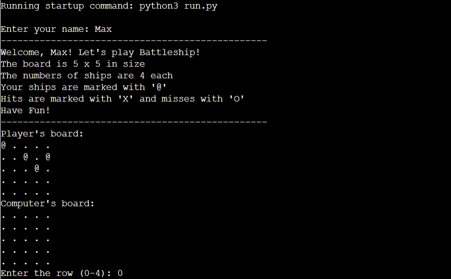
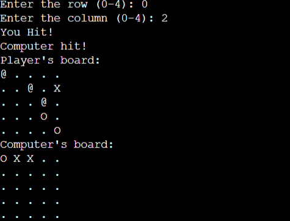
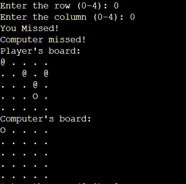
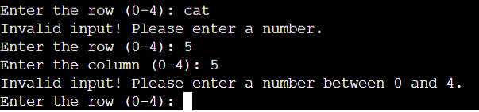
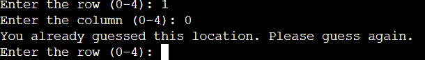
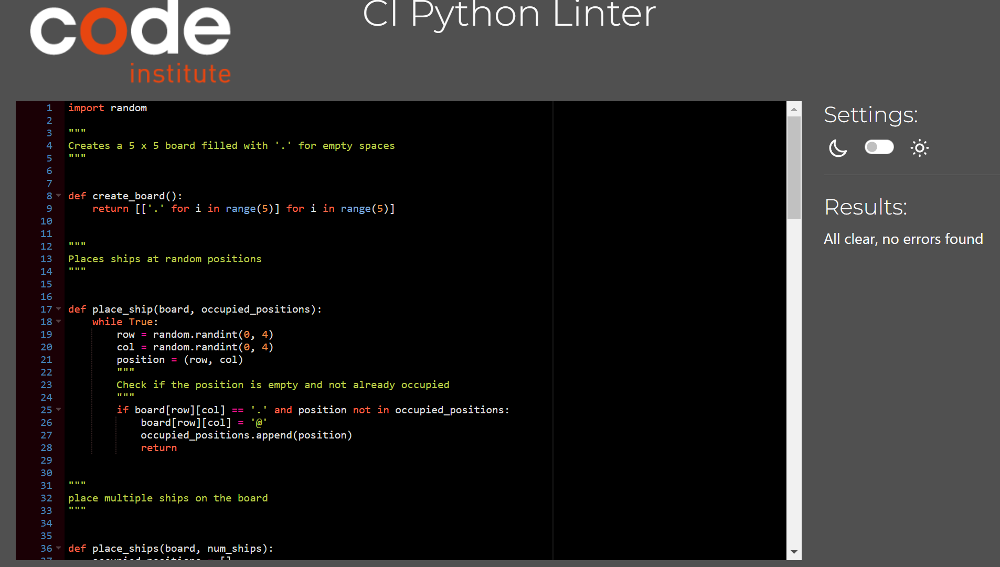

<h1 align="center">Battleships</h1>

View my live project [here](https://battleships-mkm-f442ab38425d.herokuapp.com/)

Battleships is a Python terminal game which run in the Code Institute mock terminal on Heroku.

Battleships is a board game in which the player tries to destroy the other players ships first.

## How to play

Battleships is a board game that uses a grid that can vary in size. 

Each player has a set amount of ships they place on their grid (ships can also vary in size and shape), hidden from the other player.

Each player takes a turn to guess a row and column to take a shot.

If they hit the other players ship they mark it as hit and vice versa.

The player to destroy all the other's ships, wins. 

### My Version

In my version, the player plays against the computer on a 5x5 grid.

Each player has 4 ships that occupy one space and are randomly placed.

The player can see their own placement of his ships marked with '@'

Whenever the player guesses, their hits will be marked with 'X' and misses with 'O' on the computers board and vice versa.

The player keeps guessing until they hit all the computers ships or vice versa.

## Features

### Existing Features
 - 5x5 board grid.
 - input for player name.
 - Randomly places ships for player and computer.
 - The computer ships are hidden from the player.

 
 - Icons to notify hits and misses as well as text.

 
 

 - Invalid inputs
    - Player must enter a number
    - Player must enter a number between 0-4
    - Player must not guess the same spot

 
 

### Future Features
 - Player and Computer scores to keep track of who is winning.
 - Various grid sizes that the player can choose from.
 - Various ship sizes and shapes
 - Choice of placement for the players ships.

## Testing

I have manually tested this project by doing the following:
 - Passed the code through a PEP8 linter and confirmed there are no problems.
 - Given incorrect inputs such as, strings when numbers are needed for guessing, out of bounds inputs, previous inputs.
 - Tested in my local terminal and the Code Institute Heroku terminal

## Bugs

### Solved Bugs
- The player and computer guesses were going on the wrong boards. easy fix by flipping the boards around.
- The computer would guess the same locations, struggled a lot with this, but confident I found the solution by adding the occupied_positions functionality to the place_ship function. 

## Remaining Bugs
- No remaining bugs as far as I can tell.

## Validator Testing
 - PEP8
  - No errors returned from pep8ci.herokuapp.com

## Deployment

This project was deployed using Code Institute's mock terminal for Heroku.

 - Steps for deployment:
  - Fork or clone this repository
  - Create a new Heroku app
  - Set the buildpacks to 'Python' and 'NodeJS' in that order
  - Link the Heroku app to the repository
  - Click on Deploy

## Credits

### Help
 - The information, planning and overall knowledge for this project from Code Institute's "Love Sandwiches" Project. specifically..
    - Setting up the workspace from Love Sandwiches > Getting set up Module
    - the use of visual planning and function planning in the Love Sandwiches > Adding Sales Data & Calculating Sales Data Modules
    - The deployment information from Love Sandwiches > Deployment > Deploying our Project Part 1 & 2 
 - I gain inspiration specific and knowledge of the many different ways to code for battleships from a few youtube videos. (I didn't really take much of there coding examples into my project, mainly just explored the various ways of doing each functionality of the game so I could come up with my own. They covered a lot of Python I am not familiar with yet so it was mainly a way for me to plan my own structure for Battleships.)
  - [CS Student](https://www.youtube.com/watch?v=MgJBgnsDcF0&ab_channel=CSStudents)
  - [Knowledge Mavens](https://www.youtube.com/watch?v=tF1WRCrd_HQ&t=1495s&ab_channel=KnowledgeMavens)
  - [HBCoding](https://www.youtube.com/watch?v=FkUOjjD5qtM&ab_channel=HBCoding)

### Acknowledgements
 - The Code Institute tutor support team for help with problems within the code.
 - My mentor for continued help and feedback throughout the project.
